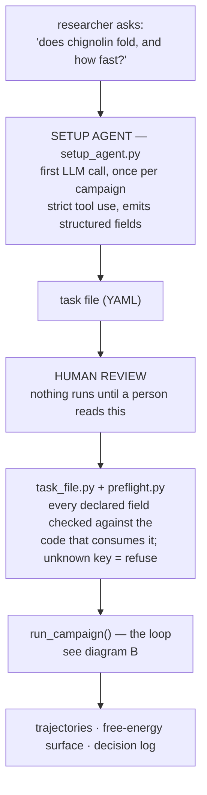
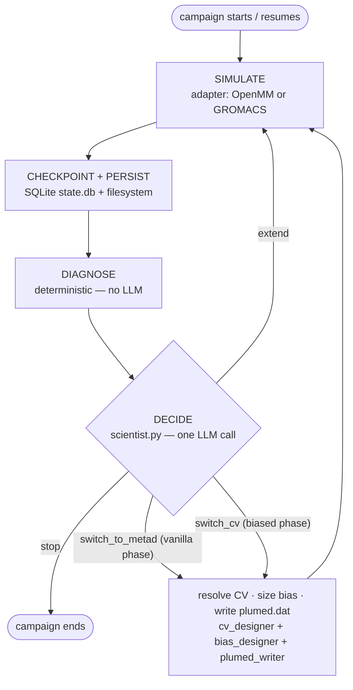
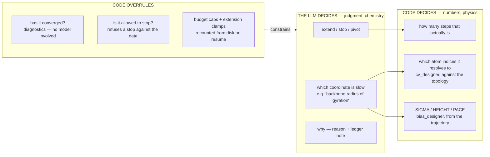

# MDPilot — architecture at a glance

Three diagrams, in the order you would draw them on a whiteboard. For the
reasoning behind these choices see `architecture.md`; for the empirical
failures most of the guardrails came from, see `activity-log.md`.

> Most MD agents automate the *inner* loop — set up, submit, analyze.
> MDPilot owns the *outer* loop: look at the result, judge whether it answers
> the question, decide what to run next.

---

## A — End to end

One LLM call turns a question into a reviewable spec. A human approves it.
Deterministic Python builds and runs everything after that.

The point to say out loud: **the LLM never touches the simulation.** It writes
a proposal, a human approves it, deterministic Python builds it.

---

## B — Inside the loop

One LLM call per round. Everything else is a mechanical state machine.

### Two phases, and the phase changes what the agent may see

Not the same numbers relabelled — genuinely different report bundles. A biased
trajectory is not an equilibrium ensemble, so effective sample size and
"plateau reached" do not describe convergence there: a long correlation time
means the bias is still filling, and a bimodal marginal means the bias
*worked*. Handing those to the model as convergence evidence is a category
error, so they are absent rather than discouraged.

| | phase `vanilla` | phase `metad` |
|---|---|---|
| what is running | unbiased MD | well-tempered metadynamics on a CV |
| diagnostics | block-averaged SEM autocorrelation → ESS bimodality → exploring? | HILLS → free-energy surface drift between successive estimates barrier recrossings |
| action space | `extend` · `stop` · `switch_to_metad` | `extend` · `stop` · `switch_cv` |

The action space is enforced by the **tool schema**, not the prompt. If an
action is not valid this round it is not in the enum — unrepresentable rather
than discouraged. A second pivot does not exist in the biased schema;
`switch_to_metad` is dropped entirely from campaigns that declared no
expectation to judge a pivot against.

---

## C — The boundary

If you only draw one thing, draw this. Nothing with a physical unit ever
passes through the model.

Everything on the right is deterministic, testable and reproducible. That is
what makes a campaign auditable: `plumed.dat` and the per-round records can be
read back months later and say exactly what ran and why.

### Why the split falls where it does

A quantity with a right answer derivable from the data should be derived, not
generated — however good the model is. The failure mode is not a crash. A
wrong hill width produces a run that completes, emits output, and silently
resolves nothing (`activity-log.md`, F4). A wrong number in this domain looks
exactly like a right one.

### The yardstick the agent does not control

The agent chooses which coordinate to bias. It is *scored* on a coordinate the
task file fixes for the life of the campaign — usually not the one being
biased. Counting success on the agent's own chosen coordinate was tried and
failed in both directions within one campaign: a collapsed surface scored 22
and 26 "crossings" that were thermal jiggle inside a single state, while
rounds that could not resolve two basins reported 0 when the truth was
"cannot measure" (F7, F9). Now "cannot measure" reports as null, and the
convergence check withholds a verdict rather than calling it failure.
